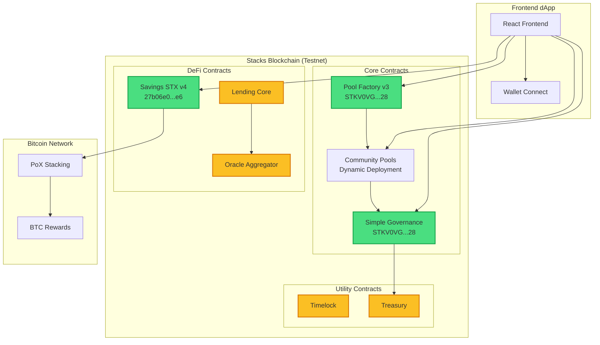

# WashikaDAO 🌍

**A decentralized protocol on Stacks blockchain empowering marginalized communities through governance, community pools, and DeFi services.**

## 🏗️ **System Architecture**



## 🌟 **Features**

### ✅ **Governance System (Live)**
- **Pool-Based Participation**: Only community pool members can create and vote on proposals
- **STX-Based Voting Power**: 1 STX = 1 vote (no governance tokens required)
- **Three Proposal Types**: 
  - 💰 Fund Allocation (treasury distributions)
  - ⚙️ Pool Parameters (configuration changes)
  - 📋 General (community decisions)
- **Real-time Blockchain Integration**: All proposals and votes stored permanently on-chain
- **Member Verification**: Automatic pool membership detection

### ✅ **Community Pool System (Live)**
- **Pool Factory**: Decentralized pool creation and management
- **Flexible Contributions**: Members can join and contribute STX at any time
- **Governance Integration**: Pool membership grants governance privileges
- **Share-Based Accounting**: Fair distribution based on contribution shares
- **Pool Statistics**: Real-time member count, total contributions, and exchange rates

### ✅ **STX Savings (Live)**
- **Secure Deposits**: Deposit STX into community-managed savings pools
- **Share-Based Returns**: Earn proportional rewards based on pool shares
- **Flexible Withdrawals**: Withdraw shares at any time
- **Pool Statistics**: Track total deposits, user shares, and exchange rates

### 🚧 **In Development**
- **PoX Stacking Integration**: Automatic BTC rewards through Stacks consensus
- **sBTC Support**: Deposit and earn rewards on synthetic Bitcoin
- **Lending Protocol**: Collateralized loans against STX/sBTC deposits
- **Oracle System**: Decentralized price feeds for accurate asset valuations
- **Advanced Governance**: Multi-signature proposals and execution delays

## 🚀 **Quick Start**

### **Prerequisites**
- Node.js 18+ and npm
- Stacks wallet (Hiro Wallet, Xverse, etc.)
- STX tokens for testnet (get from [Stacks Faucet](https://explorer.stacks.co/sandbox/faucet))

### **Frontend Development**
```bash
# Clone and setup
git clone <repository-url>
cd washika-dao/frontend

# Install dependencies
npm install

# Start development server
npm run dev

# Build for production
npm run build
```

### **Deploy New Contracts**
```bash
# Set your private key
export STACKS_PRIVATE_KEY=your_private_key_here

# Deploy governance contract
node deploy-governance.js

# Deploy community pool
node deploy-pool.js "Pool Name" 1000000 144 10
# Args: name, contribution_amount_ustx, cycle_blocks, max_members

# Deploy savings contract
node deploy-savings.js
```

### **Using the dApp**
1. **Connect Wallet**: Use Hiro Wallet or Xverse to connect
2. **Join/Create Pool**: Navigate to Pools page to browse or create community pools
3. **Contribute STX**: Add STX to pools to become a member
4. **Participate in Governance**: Create and vote on proposals as a pool member
5. **Earn Rewards**: Deposit STX in savings pools to earn returns

## 📁 **Project Structure**

```
washika-dao/
├── contracts/                    # Clarity Smart Contracts
│   ├── simple-governance.clar   # ✅ Governance system (DEPLOYED)
│   ├── pool-factory.clar        # ✅ Pool factory (DEPLOYED)
│   ├── community-pool-simple.clar # Community pool template
│   ├── savings-stx.clar         # ✅ STX savings (DEPLOYED)
│   ├── washika-dao.clar         # 🚧 Advanced governance
│   ├── lending-core.clar        # 🚧 Lending protocol
│   ├── oracle-aggregator.clar   # 🚧 Price oracles
│   ├── treasury.clar            # 🚧 Treasury management
│   └── traits/                  # Contract interfaces
│
├── frontend/                     # React TypeScript Frontend
│   ├── src/
│   │   ├── components/          # Reusable UI components
│   │   │   ├── governance/      # Governance-specific components
│   │   │   ├── pools/           # Pool management components
│   │   │   └── ui/              # Base UI components (shadcn/ui)
│   │   ├── pages/               # Application pages
│   │   │   ├── Governance.tsx   # Governance dashboard
│   │   │   ├── PoolSelection.tsx # Pool browsing/creation
│   │   │   ├── CommunityPool.tsx # Individual pool management
│   │   │   └── Savings.tsx      # Savings interface
│   │   ├── hooks/               # Custom React hooks
│   │   │   ├── useContract.ts   # Contract interaction
│   │   │   ├── usePoolFactory.ts # Pool factory integration
│   │   │   └── useStacks.ts     # Stacks wallet integration
│   │   ├── utils/               # Utility functions
│   │   │   ├── stacks.ts        # Stacks blockchain utilities
│   │   │   └── contracts.js     # Contract configurations
│   │   └── lib/                 # External library configurations
│
├── deployment/                   # Deployment Scripts
│   ├── deploy-governance.js     # Deploy governance contract
│   ├── deploy-pool.js           # Deploy community pools
│   ├── deploy-savings.js        # Deploy savings contract
│   └── update-frontend-config.js # Update contract addresses
│
├── docs/                        # Documentation
└── README.md                    # This file
```

## 🌐 **Deployed Contracts (Stacks Testnet)**

### **Core Governance & Pool System**
| Contract | Address | Status | Description |
|----------|---------|--------|--------------|
| **Simple Governance** | [`STKV0VGBVWGZMGRCQR3SY6R11FED3FW4WRYMWF28.simple-governance`](https://explorer.stacks.co/address/STKV0VGBVWGZMGRCQR3SY6R11FED3FW4WRYMWF28.simple-governance?chain=testnet) | ✅ **Live** | Pool-based governance with STX voting |
| **Pool Factory v3** | [`STKV0VGBVWGZMGRCQR3SY6R11FED3FW4WRYMWF28.pool-factory-v3`](https://explorer.stacks.co/address/STKV0VGBVWGZMGRCQR3SY6R11FED3FW4WRYMWF28.pool-factory-v3?chain=testnet) | ✅ **Live** | Community pool creation and management |
| **STX Savings v4** | [`27b06e0bdf21fa430cbe079f1b010bdcd1bf84e6.savings-stx-v4`](https://explorer.stacks.co/address/27b06e0bdf21fa430cbe079f1b010bdcd1bf84e6.savings-stx-v4?chain=testnet) | ✅ **Live** | STX deposits with share-based accounting |

### **Deployment Information**
- **Network**: Stacks Testnet
- **Deployment Date**: October 16, 2024
- **Latest Governance Transaction**: [`0x42d15365b9437ff647844869d684eab2018b370eab43357dabc512ec389ada35`](https://explorer.stacks.co/txid/0x42d15365b9437ff647844869d684eab2018b370eab43357dabc512ec389ada35?chain=testnet)
- **Latest Savings Transaction**: [`dd9b962aab043cdb2ef4f604dba48a3d1bb47ddae85104e2ee0af412751bf75d`](https://explorer.stacks.co/txid/dd9b962aab043cdb2ef4f604dba48a3d1bb47ddae85104e2ee0af412751bf75d?chain=testnet)

### **Contract Features**

#### **Simple Governance Contract**
- ✅ `create-proposal(title, description, type, amount?, recipient?)` - Create governance proposals
- ✅ `cast-vote(proposal-id, support)` - Vote on proposals (0=against, 1=for, 2=abstain)
- ✅ `get-proposal-count()` - Get total number of proposals
- ✅ `get-proposal(id)` - Get proposal details
- ✅ `has-voted(proposal-id, voter)` - Check voting status

#### **Pool Factory Contract**
- ✅ `create-pool(name, contribution-amount, cycle-blocks, max-members)` - Create new community pool
- ✅ `get-pool-count()` - Get total number of pools
- ✅ `get-pool(id)` - Get pool information
- ✅ `is-pool-member(pool-id, user)` - Check pool membership

#### **STX Savings Contract**
- ✅ `deposit-stx()` - Deposit STX and receive shares
- ✅ `withdraw-stx(shares)` - Withdraw STX by burning shares
- ✅ `get-user-shares(user)` - Get user's share balance
- ✅ `get-pool-info()` - Get pool statistics
- ✅ `get-exchange-rate()` - Get STX to shares exchange rate

## 🛠️ **Technology Stack**

### **Blockchain**
- **Stacks Blockchain**: Layer-1 blockchain secured by Bitcoin
- **Clarity Smart Contracts**: Safe, decidable smart contract language
- **PoX Consensus**: Proof of Transfer connecting to Bitcoin security

### **Frontend**
- **React 18**: Modern React with hooks and TypeScript
- **TypeScript**: Type-safe development
- **Tailwind CSS**: Utility-first CSS framework
- **shadcn/ui**: High-quality component library
- **React Query**: Server state management
- **Lucide Icons**: Beautiful, customizable icons

### **Stacks Integration**
- **@stacks/connect**: Wallet connection and authentication
- **@stacks/transactions**: Transaction building and signing
- **@stacks/network**: Network configuration and API calls

## 🧪 **Testing**

### **Contract Testing**
```bash
# Install Clarinet (Stacks development tool)
curl --proto '=https' --tlsv1.2 -sSf https://sh.rustup.rs | sh
cargo install clarinet

# Run contract tests
clarinet test

# Check contract syntax
clarinet check
```

### **Frontend Testing**
```bash
cd frontend

# Run unit tests
npm test

# Run integration tests
npm run test:integration

# Type checking
npm run type-check
```

## 🚀 **Deployment Guide**

### **Contract Deployment**
1. **Setup Environment**:
   ```bash
   export STACKS_PRIVATE_KEY="your-private-key"
   export STACKS_NETWORK="testnet"  # or "mainnet"
   ```

2. **Deploy Contracts**:
   ```bash
   # Deploy in order (dependencies first)
   node deploy-governance.js
   node deploy-pool.js "Community Pool" 1000000 144 50
   node deploy-savings.js
   ```

3. **Update Frontend Configuration**:
   ```bash
   node update-frontend-config.js
   ```

### **Frontend Deployment**
```bash
cd frontend
npm run build

# Deploy to Vercel, Netlify, or your preferred platform
# Environment variables needed:
# - VITE_STACKS_NETWORK=testnet
# - VITE_CONTRACT_ADDRESS=your-contract-address
```

## 🤝 **Contributing**

We welcome contributions from the community! Here's how to get started:

### **Development Setup**
1. **Fork and Clone**:
   ```bash
   git clone https://github.com/your-username/washika-dao.git
   cd washika-dao
   ```

2. **Install Dependencies**:
   ```bash
   cd frontend && npm install
   ```

3. **Create Feature Branch**:
   ```bash
   git checkout -b feature/your-feature-name
   ```

### **Contribution Guidelines**
- 📝 **Code Style**: Follow TypeScript and Clarity best practices
- 🧪 **Testing**: Add tests for new features
- 📚 **Documentation**: Update README and inline comments
- 🔍 **Security**: Follow security best practices for DeFi protocols
- 🌍 **Accessibility**: Ensure UI is accessible to all users

### **Pull Request Process**
1. Ensure all tests pass
2. Update documentation as needed
3. Add clear commit messages
4. Submit PR with detailed description
5. Respond to code review feedback

## 🔒 **Security**

- **Smart Contract Audits**: Contracts undergo thorough testing
- **Testnet First**: All features tested on testnet before mainnet
- **Community Review**: Open-source development with community oversight
- **Best Practices**: Following Stacks and Clarity security guidelines

## 📞 **Support & Community**

- **Documentation**: Comprehensive guides and API references
- **Community Forum**: Join discussions and get help
- **Discord**: Real-time community chat
- **GitHub Issues**: Bug reports and feature requests

## 🗺️ **Roadmap**

### **Phase 1: Foundation** ✅
- [x] Basic governance system
- [x] Community pool creation
- [x] STX savings pools
- [x] Wallet integration

### **Phase 2: DeFi Integration** 🚧
- [ ] PoX stacking integration
- [ ] sBTC support
- [ ] Lending protocol
- [ ] Oracle price feeds

### **Phase 3: Advanced Features** 📋
- [ ] Multi-signature governance
- [ ] Cross-chain bridges
- [ ] Mobile application
- [ ] Governance token (WASHA)

### **Phase 4: Mainnet & Scale** 🎯
- [ ] Mainnet deployment
- [ ] Security audits
- [ ] Partnership integrations
- [ ] Global community expansion

## 📄 **License**

MIT License - see [LICENSE](LICENSE) file for details.

---

**Built with ❤️ for marginalized communities worldwide**

*Empowering financial inclusion through decentralized technology on Bitcoin's security layer.*
